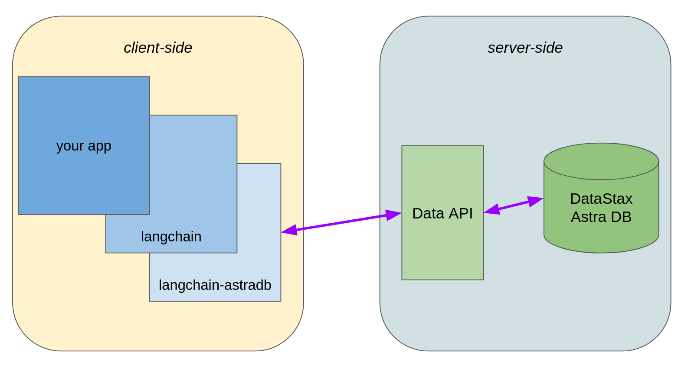

# langchain-astradb

This package contains the LangChain integrations for using DataStax Astra DB.

> DataStax [Astra DB](https://docs.datastax.com/en/astra/home/astra.html) is a serverless vector-capable database built on Apache Cassandra® and made conveniently available
> through an easy-to-use JSON API.

> [!IMPORTANT]
> This package replaces the _deprecated_ Astra DB classes found under `langchain_community.*`. Migrating away from the community plugins is strongly advised to get the latest features, fixes, and compatibility with modern versions of the AstraPy Data API client.

## Architecture sketch



## Installation and Setup

Installation of this partner package:

```bash
pip install langchain-astradb
```

## Integrations overview

See the [LangChain docs page](https://python.langchain.com/docs/integrations/providers/astradb) and the [API reference](https://python.langchain.com/api_reference/astradb/index.html) for more details.

### Vector Store

```python
from langchain_astradb import AstraDBVectorStore

my_store = AstraDBVectorStore(
  embedding=my_embedding,
  collection_name="my_store",
  api_endpoint="https://...",
  token="AstraCS:...",
)
```

Class `AstraDBVectorStore` supports server-side embeddings ("vectorize"), hybrid search (vector ANN + BM25 + reranker), autodetect on arbitrary collections, non-Astra DB deployments of Data API, and more. [Example notebook](https://python.langchain.com/docs/integrations/vectorstores/astradb/).

### Chat message history

```python
from langchain_astradb import AstraDBChatMessageHistory

message_history = AstraDBChatMessageHistory(
    session_id="test-session",
    api_endpoint="https://...",
    token="AstraCS:...",
)
```

### LLM Cache

```python
from langchain_astradb import AstraDBCache

cache = AstraDBCache(
    api_endpoint="https://...",
    token="AstraCS:...",
)
```

### Semantic LLM Cache

```python
from langchain_astradb import AstraDBSemanticCache

cache = AstraDBSemanticCache(
    embedding=my_embedding,
    api_endpoint="https://...",
    token="AstraCS:...",
)
```

### Document loader

```python
from langchain_astradb import AstraDBLoader

loader = AstraDBLoader(
    collection_name="my_collection",
    api_endpoint="https://...",
    token="AstraCS:...",
)
```

### Store

```python
from langchain_astradb import AstraDBStore

store = AstraDBStore(
    collection_name="my_kv_store",
    api_endpoint="https://...",
    token="AstraCS:...",
)
```

### Byte Store

```python
from langchain_astradb import AstraDBByteStore

store = AstraDBByteStore(
    collection_name="my_kv_store",
    api_endpoint="https://...",
    token="AstraCS:...",
)
```


## Collection defaults mismatch

The Astra DB plugins default to idempotency as far as database provisioning is concerned.

This means that, unless requested otherwise, creating an instance of e.g. `AstraDBVectorStore`
will trigger the creation of the underlying Astra DB collection in the target database.

For a collection that already exists, _if the requested configuration matches what's on DB,_
this is no problem: the Data API responds successfully and the whole 'creation' is a no-op.

However, if the create command specifies a different configuration than
the already-existing collection, an error is returned by the Data API
(with an error code of `EXISTING_COLLECTION_DIFFERENT_SETTINGS`) and reported
back to the LangChain user. A possible occurrence of this issue is related to indexing
settings (see [the dedicated section](https://github.com/langchain-ai/langchain-datastax/blob/main/libs/astradb/README.md#warnings-about-indexing) for guidance).

### The case of hybrid search

The introduction of "hybrid search" in the Data API, and the fact that the collection
defaults have been changed accordingly, may also lead to one such mismatch error.

Most recent deployments of the Data API configure new collections to be equipped
for hybrid search by default. On such deployments, when running an `AstraDBVectorStore`
workload based on a pre-existing collection a mismatch may be detected (a new create-collection
API command will effectively try to create a differently-configured object on DB).

Here are three suggested ways to remediate the problem:

**Solution one** is to let the `AstraDBVectorStore` autodetect the configuration
and behave accordingly in its data read/write operations. This assumes the collection
already exists, and has the advantage that hybrid capabilities are picked up automatically:

```python
vector_store = AstraDBVectorStore(
    collection_name="astra_existing_collection",
    # embedding=...,  # needed unless using 'vectorize'
    api_endpoint=ASTRA_DB_API_ENDPOINT,
    token=ASTRA_DB_APPLICATION_TOKEN,
    autodetect_collection=True,
)
```

**Solution two** is to simply turn off the actual collection creation step with
the `setup_mode` constructor parameter. The store
behaviour is entirely dictated by the passed parameters, simply no attempt is made
to create the collection on DB. This can work if you are sure that the collection
exists, and has the effect of full predictability of the workload: in particular,
even if the hybrid capabilities could be detected, whether to use them or not
depends only on the passed constructor parameters:

```python
from langchain_astradb.utils.astradb import SetupMode

vector_store = AstraDBVectorStore(
    collection_name="astra_existing_collection",
    # embedding=...,  # needed unless using 'vectorize'
    api_endpoint=ASTRA_DB_API_ENDPOINT,
    token=ASTRA_DB_APPLICATION_TOKEN,
    collection_vector_service_options=VectorServiceOptions(...),  # if 'vectorize'
    setup_mode=SetupMode.OFF
)
```

**Solution three** is to specify your hybrid-related settings (reranker and lexical)
for the store to exactly match what's on the database (including the case of turning these off):

```python
from astrapy.info import (
    CollectionLexicalOptions,
    CollectionRerankOptions,
    RerankServiceOptions,
    VectorServiceOptions,
)

# hybrid-related capabilities explicitly ON
vector_store = AstraDBVectorStore(
    collection_name="astra_existing_collection",
    api_endpoint=ASTRA_DB_API_ENDPOINT,
    token=ASTRA_DB_APPLICATION_TOKEN,
    collection_vector_service_options=VectorServiceOptions(...),
    collection_lexical=CollectionLexicalOptions(analyzer="standard"),
    collection_rerank=CollectionRerankOptions(
        service=RerankServiceOptions(
            provider="nvidia",
            model_name="nvidia/llama-3.2-nv-rerankqa-1b-v2",
        ),
    ),
    collection_reranking_api_key=...,  # if needed by the model/setup
)

# hybrid-related capabilities explicitly OFF
vector_store = AstraDBVectorStore(
    collection_name="astra_existing_collection",
    api_endpoint=ASTRA_DB_API_ENDPOINT,
    token=ASTRA_DB_APPLICATION_TOKEN,
    collection_vector_service_options=VectorServiceOptions(...),
    collection_lexical=CollectionLexicalOptions(enabled=False),
    collection_rerank=CollectionRerankOptions(enabled=False),
)
```

(the two examples above, with and without hybrid capabilities, assume a
vectorize-enabled collection, i.e. with server-side embedding computation.)


## Warnings about indexing

When creating an Astra DB object in LangChain, such as an `AstraDBVectorStore`, you may see a warning similar to the following:

> Astra DB collection '...' is detected as having indexing turned on for all fields (either created manually or by older versions of this plugin). This implies stricter limitations on the amount of text each string in a document can store. Consider reindexing anew on a fresh collection to be able to store longer texts.

The reason for the warning is that the requested collection already exists on the database, and it is configured to [index all of its fields for search](https://docs.datastax.com/en/astra-db-serverless/api-reference/collections.html#the-indexing-option), possibly implicitly, by default. When the LangChain object tries to create it, it attempts to enforce, instead, an indexing policy tailored to the prospected usage. For example, the LangChain vector store will index the metadata but leave the textual content out: this is both to enable storing very long texts and to avoid indexing fields that will never be used in filtering a search (indexing those would also have a slight performance cost for writes).

Typically there are two reasons why you may encounter the warning:

1. you have created a collection by other means than letting the `AstraDBVectorStore` do it for you: for example, through the Astra UI, or using AstraPy's `create_collection` method of class `Database` directly;
2. you have created the collection with a version of the Astra DB plugin that is not up-to-date (i.e. prior to the `langchain-astradb` partner package).

Keep in mind that this is a warning and your application will continue running just fine, as long as you don't store very long texts.
Should you need to add to a vector store, for example, a `Document` whose `page_content` exceeds ~8K in length, you will receive an indexing error from the database.

### Remediation

You have several options:

- you can ignore the warning because you know your application will never need to store very long textual contents;
- you can ignore the warning and explicitly instruct the plugin _not to_ create the collection, assuming it exists already (which suppresses the warning): `store = AstraDBVectorStore(..., setup_mode=langchain_astradb.utils.astradb.SetupMode.OFF)`. In this case the collection will be used as-is, no (indexing) questions asked;
- if you can afford populating the collection anew, you can drop it and re-run the LangChain application: the collection will be created with the optimized indexing settings. **This is the recommended option, when possible**.
